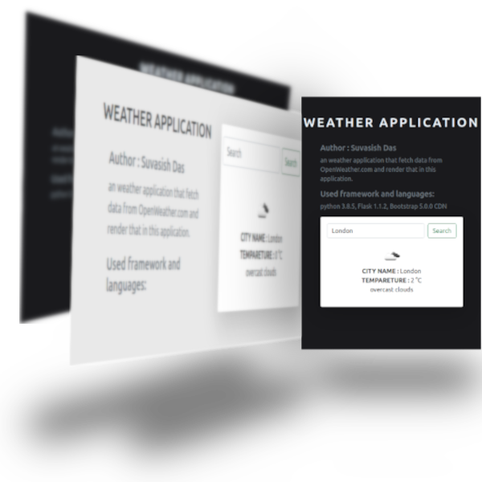

# weather-application

<!--</img>-->

A simple weather application using <strong>Flask</strong>, which fetch data from <a href="https://openweathermap.org/"><strong>openweathermap.org</strong></a> and render in this application.

## How to run :

to run this application you need to create a python-virtual enviornment by running 
```sh
$ python -m venv <virtualenv_name>
```
after that you have to install the dependencies
```sh
(venv)$ pip install flask
(venv)$ pip install requests
(venv)$ pip install flask-wtf
```
now you are all ready to run the application
```sh
(venv)$ python app.py
```
now go to your localhosts port 5000 and check the result.


## Language and Tools :
<ul>
<li><strong>python 3.8.5</strong></li>
<li><strong>Flask 1.1.2</strong></li>
<li><strong>Bootstrap 5.0.0 CDN</strong></li>
</ul>

###### © suvasish114
