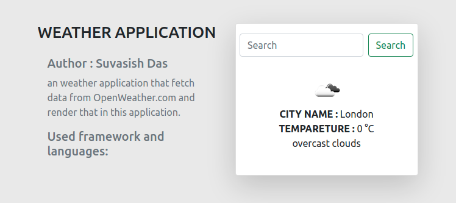

# weather-application

</img>

A simple weather application using <strong>Flask</strong>, which fetch data from <a href="https://openweathermap.org/"><strong>openweathermap.org</strong></a> and render in this application.

## Language and Tools :
<ul>
<li><strong>python 3.8.5</strong></li>
<li><strong>Flask 1.1.2</strong></li>
<li><strong>Bootstrap 5.0.0 CDN</strong></li>
</ul>